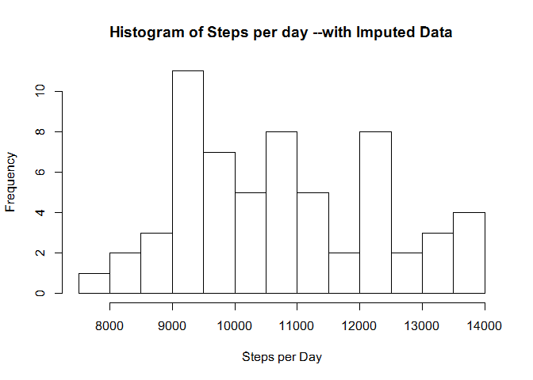
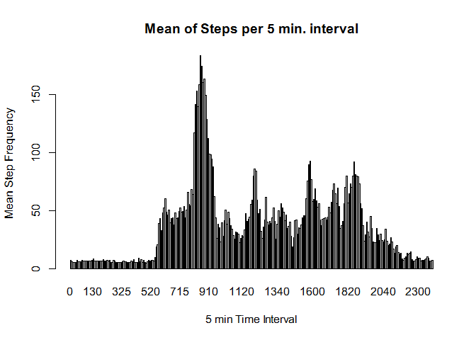
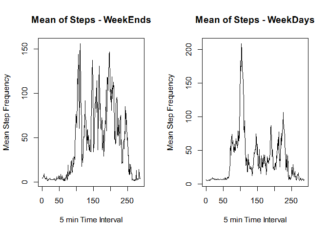

# Reproducible Research: Peer Assessment 1


## Loading and preprocessing the data

The complete set of code for processing and preparing the data for analysis -- exclusive of any code for graphs -- follows.


```r
library("lubridate")
library(dplyr)
```

```
## 
## Attaching package: 'dplyr'
## 
## The following objects are masked from 'package:lubridate':
## 
##     intersect, setdiff, union
## 
## The following object is masked from 'package:stats':
## 
##     filter
## 
## The following objects are masked from 'package:base':
## 
##     intersect, setdiff, setequal, union
```

```r
activity <- read.csv("J:/coursera/DataScience/RepResearch/RepData_PeerAssessment1/activity.csv", stringsAsFactors=FALSE)

activity$date <- as.Date(activity$date, "%Y-%m-%d")
activity$date <- as.Date(activity$date, "%Y-%m-%d")
activity$dow <- wday(activity$date)
activity$DOY <- strftime(activity$date, format = "%j")

activity$daytype[with(activity, dow > 1 & dow <7)] <- "weekday" 
activity$daytype[with(activity, dow == 1 | dow ==7)] <- "weekend" 


myIncomplete <- activity[!complete.cases(activity),]
completeActivity <- activity[complete.cases(activity),]


# shorten "completeActivity" name for convenience
ca <- completeActivity

g1 <- ca
group <- factor(unique(ca$DOY))
g1 <- data.frame(group=group,ca)

hmgroup = factor(unique(ca$interval))
hg2 <- data.frame(group=hmgroup, ca)

# create a summary table from the g1 table for daily summaries
# for Histogram of StepsPerDay
spdt <- summarise(group_by(g1, group), spd = sum(steps))
spit <- summarise(group_by(hg2, group), spm = mean(steps))

averageStepsPerDay <- round(mean(spdt$spd),0)
medianStepsPerDay <- round(median(spdt$spd),0)

tpMax <- max(spit$spm)
tpMaxRow <- spit[spit$spm >= tpMax,]
tpmr <- tpMaxRow[1,1]

# merge myIncomplete and spit (which contains means based on interval)
# The merge and cobersion to "integer" works well enoough for this purpose
merged <- merge(myIncomplete, spit, by.x="interval", by.y="group", 
                all=F)
merged$spm <- round(merged$spm, 0)
merged$steps  <- merged$spm
merged <- merged[,-7]

completeMerged <- rbind(completeActivity, merged)

# dd[with(dd, order(-z, b)), ]

newMerge <- completeMerged[with(completeMerged, order(date,interval)),]

incomplete <- nrow(myIncomplete)
```


#Summaries

## What is the mean of the total number of steps taken per day?

The average steps taken per day is 1.0766\times 10^{4}.

The median number of steps per day is 1.0489\times 10^{4}.


```r
histinfo <- hist(spdt$spd, main = "Histogram of Steps per day", xlab="Steps per Day", breaks=10)
```

 


## What is the average daily activity pattern?

The average daily activity pattern  can be viewed in the following graph.


```r
barplot(spit$spm, names=spit$group, main ="Mean of Steps per 5 min. interval",
        xlab = "5 min Time Interval", ylab= "Mean Step Frequency")
```

 

The five minute interval that typically has the greatest step activity is at 835.

## Imputing missing values

When the data set was split into a "complete" data set and one with missing values there were 2304 rows with missing step data.

```r
# Imputing Values calculation
# ***************************
# merge myIncomplete and spit (which contains means based on interval)
# The merge and cobersion to "integer" works well enoough for this purpose
merged <- merge(myIncomplete, spit, by.x="interval", by.y="group", 
                all=F)
merged$spm <- round(merged$spm, 0)
merged$steps  <- merged$spm
merged <- merged[,-7]

# Bind the Complete and Imcomplet tables
completeMerged <- rbind(completeActivity, merged)
# Sort the data
newMerge <- completeMerged[with(completeMerged, order(date,interval)),]

incomplete <- nrow(myIncomplete)

# shorten "completeActivity" name for convenience
cm <- completeMerged
g1m <- cm
# create factors for summary calculations , by day and by time interval
groupcm <- factor(unique(cm$DOY))
g1m <- data.frame(group=groupcm,cm)

hmgroupm = factor(unique(cm$interval))
hg2cm <- data.frame(group=hmgroupm, cm)

#summary for steps per day
spdtcm <- summarise(group_by(g1m, group), spd = sum(steps))
#summary for average steps by interval
spitcm <- summarise(group_by(hg2cm, group), spm = mean(steps))

cmaverageStepsPerDay <- round(mean(spdtcm$spd),0)
cmmedianStepsPerDay <- round(median(spdtcm$spd),0)

# Determine row with max average steps
cmMax <- max(spitcm$spm)
cmMaxRow <- spitcm[spitcm$spm >= cmMax,]
cmmr <- tpMaxRow[1,1]
```

The histogram for the steps per day follows:


```r
histinfo <- hist(spdtcm$spd, main = "Histogram of Steps per day --with Imputed Data",  xlab="Steps per Day", breaks=10)
```

 

The following barchart shows the mean od steps per time interval -- which also can be compared to the chart in the previous section.


```r
barplot(spitcm$spm, names=spitcm$group, main ="Mean of Steps per 5 min. interval",
        xlab = "5 min Time Interval", ylab= "Mean Step Frequency")
```

 

### Summary of effects of data infill -- or Imputing data

The effects of infill can be seen in that the early morning hours have been infilled to make it appear as if there is possibly significant level of activity during early morning hours. It seems implausible to me although reasonable people might disaagree on the point... Without intimate knowledge of the sample set it would be difficult to explain.

The average value of the number of steps is ``1.0766\times 10^{4}`` as compared to 1.0766\times 10^{4} before the data set was infilled.

The median value of the number of steps is ``1.061\times 10^{4}`` as compared to the previous value of 1.0489\times 10^{4}.


## Are there differences in activity patterns between weekdays and weekends?

The following charts illustrate the difference between weekend activity and week day acitivty.

First the code which creates the two datasets for week day and week end:


```r
cmMax <- max(spitcm$spm)
cmMaxRow <- spitcm[spitcm$spm >= cmMax,]
cmmr <- tpMaxRow[1,1]

we <- cm[hg2cm$daytype == "weekend",]
wd <- cm[hg2cm$daytype == "weekday",]

wegroup = factor(unique(we$interval))
wecm <- data.frame(group=wegroup, we)

wdgroup = factor(unique(wd$interval))
wdcm <- data.frame(group=wdgroup, wd)

spitwe <- summarise(group_by(wecm, group), spm = mean(steps))
spitwd <- summarise(group_by(wdcm, group), spm = mean(steps))
```
A comparison of weekdays and weekends is presented here:


```r
par(mfrow = c(1,2))
plot(spitwe$spm,  main ="Mean of Steps - WeekEnds",
        xlab = "5 min Time Interval", ylab= "Mean Step Frequency", type="l")

plot(spitwd$spm,  main ="Mean of Steps - WeekDays",
        xlab = "5 min Time Interval", ylab= "Mean Step Frequency",
     type = "l")
```

 

```r
par(mfrow=c(1,1))
```


There is a clear difference in the charts showing a more active weekend than weekdays.

