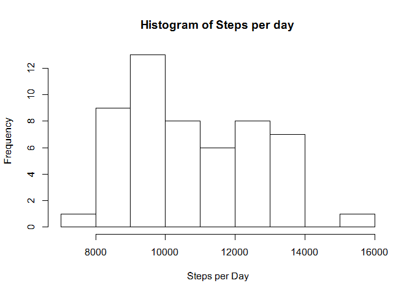
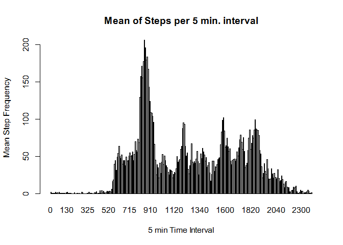

# Reproducible Research: Peer Assessment 1


## Loading and preprocessing the data

```r
library("lubridate")
library(dplyr)
```

```
## 
## Attaching package: 'dplyr'
## 
## The following objects are masked from 'package:lubridate':
## 
##     intersect, setdiff, union
## 
## The following object is masked from 'package:stats':
## 
##     filter
## 
## The following objects are masked from 'package:base':
## 
##     intersect, setdiff, setequal, union
```

```r
activity <- read.csv("J:/coursera/DataScience/RepResearch/RepData_PeerAssessment1/activity.csv", stringsAsFactors=FALSE)

activity$date <- as.Date(activity$date, "%Y-%m-%d")
activity$date <- as.Date(activity$date, "%Y-%m-%d")
activity$dow <- wday(activity$date)
activity$DOY <- strftime(activity$date, format = "%j")

activity$daytype[with(activity, dow > 1 & dow <7)] <- "weekday" 
activity$daytype[with(activity, dow == 1 | dow ==7)] <- "weekend" 


myIncomplete <- activity[!complete.cases(activity),]
completeActivity <- activity[complete.cases(activity),]


# shorten "completeActivity" name for convenience
ca <- completeActivity

g1 <- ca
group <- factor(unique(ca$DOY))
g1 <- data.frame(group=group,ca)

hmgroup = factor(unique(ca$interval))
hg2 <- data.frame(group=hmgroup, ca)

# create a summary table from the g1 table for daily summaries
# for Histogram of StepsPerDay
spdt <- summarise(group_by(g1, group), spd = sum(steps))
spit <- summarise(group_by(hg2, group), spm = mean(steps))

averageStepsPerDay <- round(mean(spdt$spd),0)
medianStepsPerDay <- round(median(spdt$spd),0)

tpMax <- max(spit$spm)
tpMaxRow <- spit[spit$spm >= tpMax,]
tpmr <- tpMaxRow[1,1]
```


#Summaries

## What is the mean of the total number of steps taken per day?

The average steps taken per day is 1.0766\times 10^{4}.

The median number of steps per day is 1.0489\times 10^{4}.


```r
histinfo <- hist(spdt$spd, main = "Histogram of Steps per day", xlab="Steps per Day", breaks=10)
```

 


## What is the average daily activity pattern?

The average daily activity pattern  can be viewed in the following graph.


```r
barplot(spit$spm, names=spit$group, main ="Mean of Steps per 5 min. interval",
        xlab = "5 min Time Interval", ylab= "Mean Step Frequency")
```

 

The five minute interval that typpically has the greatest step activity is at 835.

## Imputing missing values


## Are there differences in activity patterns between weekdays and weekends?
